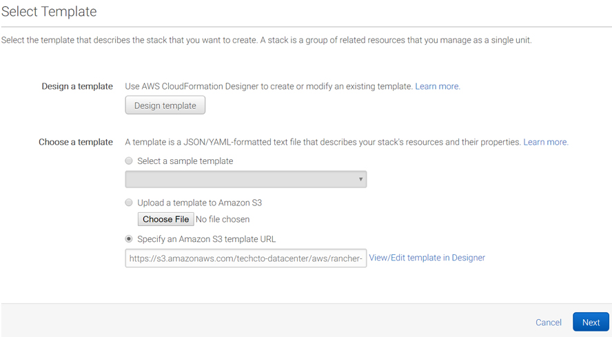

# Rancher HA on AWS
This project is under active development and is continually being improved. If you find any bugs or issues, please email help@solodev.com.

## Overview

## Prerequisites
The following is a list of prerequisites need to launch a stack. Please note that each of the following must be configured within the region you intend to launch the stack. If the following items are already created, you can skip to deploying.

* [VPC](https://s3.amazonaws.com/techcto-datacenter/aws/corp-vpc.yaml)
* [EC2 Key Pair](https://console.aws.amazon.com/ec2/v2/home?#KeyPairs:sort=keyName)
* [SSL/TLS Certificates](https://console.aws.amazon.com/acm/home?#/privatewizard/)

## Steps to Run
To launch the entire stack and deploy on AWS, click on one of the ***Launch Stack*** links below or download the Master template and launch it locally.

You can launch this CloudFormation stack, using your account, in the following AWS Regions:

| AWS Region Code | Name | Launch |
| --- | --- | --- 
| us-east-1 |US East (N. Virginia)|  |
| us-east-2 |US East (Ohio)|  |
| us-west-1 |US West (N. California)|  |
| us-west-2 |US West (Oregon)|  |
| eu-west-1 |EU (Ireland)|  |
| eu-west-2 |EU (London)|  |
| eu-central-1 |EU (Frankfurt)|  |
| ca-central-1 |Canada (Central)|  |

This will open the Create a New Stack configuration with the template preconfigured:

Click "Next" to proceed to specifying the necessary stack parameters.

## Parameters

## FAQs
